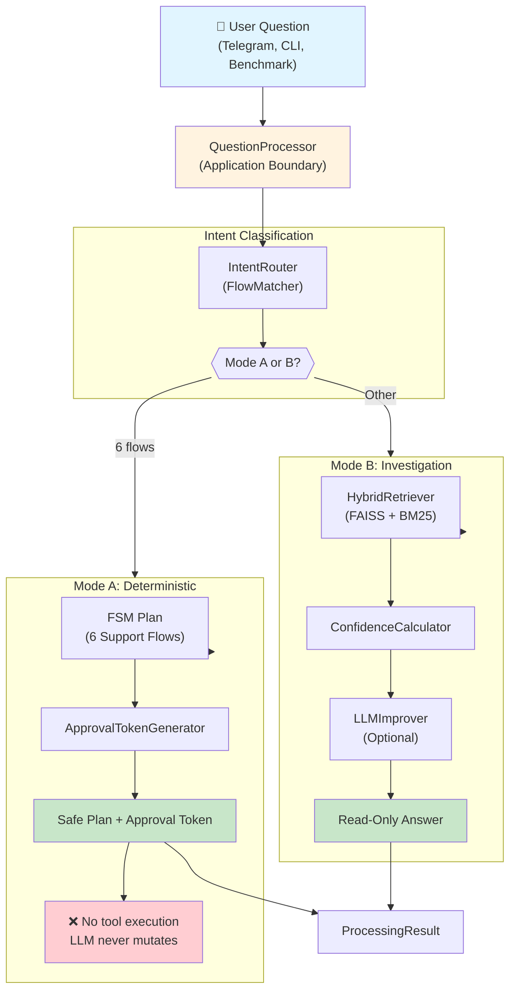
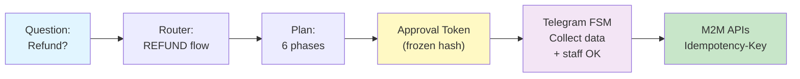
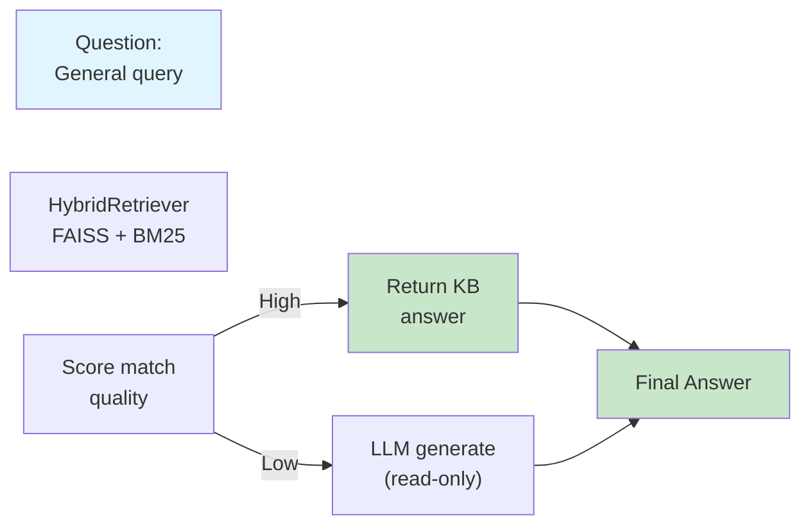
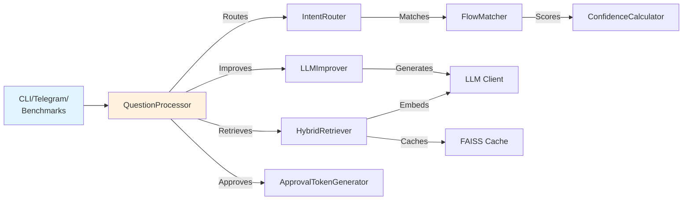

# QuickOffer Support Bot

A support-processing core that can run locally today and be connected to Telegram tomorrow. Built with Python 3.12, FastAPI, and aiogram v3.

- **Mode A** plans one of six deterministic support flows. Mutating steps remain outside the LLM and require the existing approval/FSM path.
- **Mode B** searches the knowledge base and optionally improves a read-only response with an LLM.
- The same `QuestionProcessor` is used by the local CLI, benchmarks, and future Telegram handlers.

## Table of Contents

1. [Quick Start](#quick-start)
2. [Architecture Overview](#architecture-overview)
3. [Project Structure](#project-structure)
4. [Six Support Flows](#six-support-flows)
5. [Testing & Benchmarking](#testing--benchmarking)

---

## Quick Start

### Prerequisites

- Python 3.12+
- pip or poetry

### Local Development (No Credentials Needed)

```bash
git clone <repository-url>
cd quickoffer-support-bot
pip install -e '.[dev,benchmarking]'
python -m src.benchmarking.interactive_demo
```

The demo works entirely offline. Run unit tests:

```bash
cp .env.example .env
pytest -v
```

### Mock Mode (No External APIs)

```bash
# .env
USE_MOCKS=true
python run_bot.py
```

### With LLM Provider

For local LiteLLM proxy:

```bash
# .env
LLM_PROVIDER=local
LLM_BASE_URL=http://localhost:4000/v1
LLM_PROVIDER_KEY=  # Can be empty
```

---

## Architecture Overview

### Processing Pipeline



### Mode A: Deterministic State Machine

The bot **never executes tools** in Mode A. It creates a safe plan and approval token. The Telegram FSM executes after staff approval.



### Mode B: Read-Only Investigation



### Key Components

| Component | Location | Purpose |
|-----------|----------|----------|
| **QuestionProcessor** | `src/services/processing/` | Main app boundary; routes & orchestrates |
| **IntentRouter** | `src/services/processing/` | Mode A or Mode B classifier |
| **HybridRetriever** | `src/services/processing/` | FAISS + BM25 + reranking |
| **ApprovalTokenGenerator** | `src/services/processing/` | Frozen approval tokens |
| **LLMImprover** | `src/services/processing/` | Read-only answer enhancement |
| **Telegram Router** | `src/presentation/telegram/` | aiogram FSM handlers |
| **M2M Clients** | `src/infrastructure/m2m/` | fuckhr-api, jobs-api (Idempotency-Key) |
| **Database Models** | `src/infrastructure/db/` | SQLAlchemy async ORM |

---

## Project Structure

```
quickoffer-support-bot/
├── src/
│   ├── benchmarking/              # Offline performance testing
│   │   ├── interactive_demo.py    # CLI question processor
│   │   ├── benchmark.py           # Throughput & latency benchmarks
│   │   └── rag_retriever.py       # Retrieval performance
│   ├── core/
│   │   └── config.py              # Pydantic settings (.env)
│   ├── domain/
│   │   ├── entities.py            # Domain objects (Conversation, Ticket, etc.)
│   │   └── interfaces.py          # Repository interfaces
│   ├── infrastructure/
│   │   ├── db/
│   │   │   ├── models.py          # SQLAlchemy async ORM
│   │   │   └── session.py         # Database session factory
│   │   └── m2m/
│   │       ├── clients.py         # Base HTTP client
│   │       ├── fuckhr_client.py   # FuckHR API (payments, refunds, careers)
│   │       ├── jobs_client.py     # Jobs API (archival, suppression)
│   │       ├── mock_clients.py    # Mock for local development
│   │       └── factory.py         # Client factory (USE_MOCKS toggle)
│   ├── presentation/
│   │   ├── api/
│   │   │   └── routes.py          # FastAPI webhooks & health checks
│   │   └── telegram/
│   │       ├── handlers.py        # Main handlers
│   │       ├── refund_handlers.py         # Flow 1: Refund FSM
│   │       ├── jobs_handlers.py           # Flow 3: Job Archival FSM
│   │       ├── approval_handlers.py       # Approval keyboards
│   │       ├── mode_b_handlers.py         # Mode B handlers
│   │       ├── referral_flow.py           # Flow 4: Referral promo
│   │       └── review_flow.py             # Flow 5: Review promo
│   └── services/
│       ├── processing/
│       │   ├── question_processor.py      # Main orchestrator
│       │   ├── intent_router.py           # 6-flow classifier
│       │   ├── flow_matcher.py            # Keyword & pattern matching
│       │   ├── hybrid_retriever.py        # FAISS + reranking
│       │   ├── confidence_calculator.py   # Answer scoring
│       │   ├── approval_generator.py      # Token generation
│       │   ├── llm_improver.py            # LLM enhancement
│       │   ├── processing_phases.py       # Enums & logging
│       │   └── faiss_cache.py             # Index caching
│       ├── flows/
│       │   ├── refund_flow.py             # Refund FSM states
│       │   └── jobs_archival_flow.py      # Job archival FSM
│       ├── fsm.py                         # FSM state definitions
│       ├── handoff_engine.py              # Escalation & timeouts
│       ├── llm.py                         # OpenAI-compatible LLM client
│       ├── llm_investigation.py           # LLM-only investigation
│       ├── llm_tools.py                   # Tool definitions
│       ├── approval_service.py            # Token validation
│       ├── staff_approval.py              # Staff approval workflow
│       └── identity.py                    # Telegram ID verification
├── docs/
│   ├── instruction.md                    # Operational policy (6 flows)
│   ├── rag_dataset_train.jsonl           # Training dataset
│   ├── rag_dataset_test.jsonl            # Test dataset
│   ├── classified_dialogs.jsonl          # Intent classification examples
│   └── faiss_indexes/                    # FAISS indices (generated)
├── migrations/                            # Alembic database migrations
├── tests/
│   ├── conftest.py                       # pytest config & fixtures
│   ├── test_question_processor.py        # Core processor tests
│   ├── test_config_and_llm.py            # Config & LLM tests
│   └── test_handoff_triggers.py          # Handoff & escalation tests
├── .env.example                           # Environment template
├── .clinerules                            # Project rules
├── pyproject.toml                         # Dependencies & config
├── ARCHITECTURE.md                        # Detailed architecture
├── Dockerfile                             # Container image
├── docker-compose.yml                     # Local services
├── alembic.ini                            # Migration config
└── run_bot.py                             # Entry point
```

### Module Dependencies



---

## Six Support Flows

All flows are **deterministic** (Mode A). Processor creates a plan; Telegram FSM executes after staff approval.

| # | Flow | Type | Triggers | Approval? |
|---|------|------|----------|----------|
| **1** | **Refund** | `REFUND` | "refund", "вернуть" | ✅ Yes |
| **2** | **Career Help** | `CAREER_HELP` | "career", "резюме" | ❌ No |
| **3** | **Job Archival** | `JOB_ARCHIVAL` | "archive", "архивиров" | ✅ Yes |
| **4** | **Referral Code** | `REFERRAL_PROMO` | "referral", "реф" | ❌ No |
| **5** | **Review Code** | `REVIEW_PROMO` | "review", "отзыв" | ❌ No |
| **6** | **Crypto Payment** | `CRYPTO_ALT_PAYMENT` | "crypto", "криптовалюта" | ✅ Yes |

### Flow 1: Refund & Subscription Removal

**Trigger:** "refund", "вернуть", "money back"

**Requirements:**
- Identified via Telegram ID
- Refund basis: service not started, double charge, or QuickOffer error
- Partial refund (50%) if subscription was used

**Process:**
1. Identify via Telegram ID
2. Fetch last payments from fuckhr-api
3. Validate refund basis
4. Offer subscription freeze (2-day extension)
5. If rejected, collect account ID and receipt
6. **Require staff approval** before execution
7. Execute refund + subscription revocation

### Flow 2: Career Assistance

**Trigger:** "career", "résumé", "помощь"

**Requirements:**
- Premium ≥14 days
- Discount ≤16%
- 1 case: 1 profession + 1 résumé
- SLA: 48 hours

**Process:**
1. Check eligibility (Premium + discount)
2. Collect: profession, résumé, geography, salary, experience
3. Show summary & request confirmation
4. Route to expert chat with SLA tracking
5. No approval needed

### Flow 3: Job Vacancy Archival

**Trigger:** "archive", "архивиров", "suppress"

**Requirements:**
- Staff approval required
- Permanent suppression (no re-import)

**Process:**
1. Collect: job URL/slug, reason, user status, evidence
2. Fetch job card from jobs-api for validation
3. **Require staff approval**
4. Apply `SET_PERSISTENT_SUPPRESSION` flag
5. Confirm to user

### Flow 4: Referral Promo Code

**Trigger:** "referral", "реферальный", "promo"

**Requirements:**
- 1 code per account
- 15% discount for friend
- Permanent (no expiration)
- Reused if already exists

**Process:**
1. Check Telegram ID binding
2. Fetch existing or generate new unique code
3. Return code to user (no approval needed)

### Flow 5: Review Promo Code

**Trigger:** "review", "отзыв", "feedback"

**Requirements:**
- 15% discount, permanent, single-use
- Valid review only (text > 30 chars)
- 1 code per account

**Process:**
1. Check review status on backend
2. If no review → send review form link
3. If valid review → generate/fetch code
4. Return code to user

### Flow 6: Crypto / Foreign Card Payment

**Trigger:** "crypto", "криптовалюта", "foreign card"

**Requirements:**
- Credentials from secure config (LLM never sees)
- Staff approval for subscription activation
- No auto-renewal for manual subscriptions
- No issuance if active subscription exists

**Process:**
1. Collect: tariff, period, payment method
2. Get quote + credentials from fuckhr-api
3. Send credentials + anti-fraud warning to user
4. Collect receipt or TX hash from user
5. **Require staff approval** for verification
6. Verify payment + activate subscription

---

## Testing & Benchmarking

### Unit Tests

Tests use `pytest` with custom async runner:

```bash
# Run all tests
pytest

# Verbose with output
pytest -v -s

# Run specific test
pytest tests/test_question_processor.py -v

# With coverage report
pytest --cov=src --cov-report=html
```

**Example Test:**

```python
@pytest.mark.asyncio
async def test_deterministic_request_creates_safe_plan():
    processor = QuestionProcessor()
    result = await processor.process("Refund request")
    
    assert result.context.processing_mode is ProcessingMode.MODE_A_DETERMINISTIC
    assert result.context.executed_tools == []
    assert result.context.requires_staff_approval is True
    assert result.context.approval_token is not None
```

### Interactive Demo

Local, Telegram-free CLI for testing:

```bash
python -m src.benchmarking.interactive_demo
```

**Sample Session:**

```
QuickOffer Support Bot — local demo. Type 'exit' to quit.

Question: I want a refund
Mode: mode_a_deterministic
Flow: REFUND
Requires Approval: True

Question: How do I configure search?
Mode: mode_b_investigation
Answer: Open Settings → Search → customize filters.
Confidence: high

exit
```

### Benchmarking Suite

For production-like performance evaluation:

```bash
# Throughput benchmark (questions/sec)
python -m src.benchmarking.benchmark --mode throughput --iterations 100

# Latency benchmark (p50, p95, p99)
python -m src.benchmarking.benchmark --mode latency --iterations 1000

# RAG retrieval performance
python -m src.benchmarking.rag_retriever --dataset docs/rag_dataset_test.jsonl --top-k 5
```

Outputs:
- `benchmark.log` — raw timings
- `benchmark_results.json` — aggregated stats

---

## Contributing & Code Style

### Code Formatting

```bash
# Format code (Black: 88 chars, double quotes)
black src/ tests/

# Sort imports (isort with Black profile)
isort src/ tests/

# Type check (mypy, strict mode)
mypy src/
```

**Conventions:**
- **Line length:** 88 characters (Black standard)
- **Strings:** Double quotes (`"text"`)
- **Type hints:** Mandatory (mypy strict)
- **Imports:** Sorted via isort
- **Docstrings:** NumPy style for complex functions

### Key Principles

From `.clinerules`:

1. **Strict LLM Isolation:** Never assign mutation tools to LLM agents
2. **Deterministic Flows:** State machines with Pydantic validation
3. **M2M with Approval:** All backend mutations require approval tokens + Idempotency-Key headers
4. **Frozen Snapshots:** Approval tokens hash parameters; any modification invalidates them
5. **No placeholders:** Production-ready code; no `# TODO` comments

---

## Troubleshooting

**"No such module" errors:**
```bash
pip install -e '.[dev,benchmarking]'
```

**LLM endpoint not reachable:**
Ensure LiteLLM is running:
```bash
litellm --model gpt-3.5-turbo --api_base http://localhost:4000
```

**Database migration errors:**
```bash
alembic upgrade head
```

---

## License

MIT

## Support

- **Operational Policies:** See `docs/instruction.md` (Russian)
- **Usage Examples:** Check `tests/`
- **Architecture Details:** Read [ARCHITECTURE.md](ARCHITECTURE.md)
- **Russian Documentation:** See [README_RU.md](README_RU.md)
