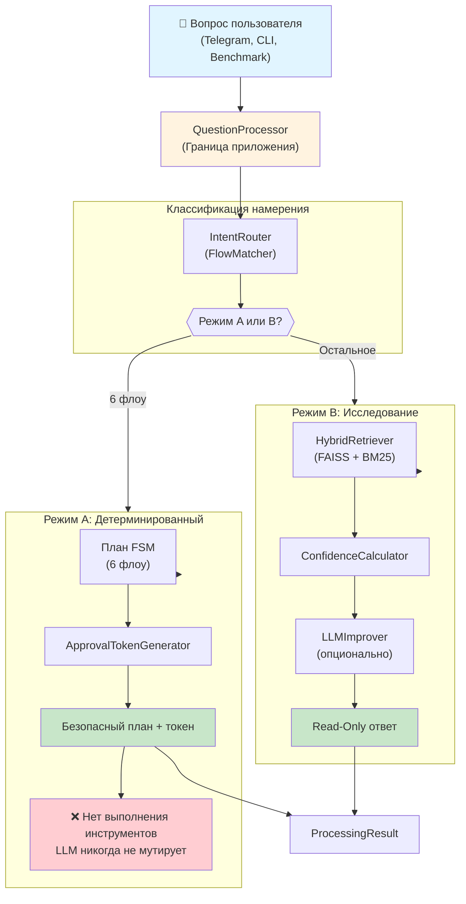
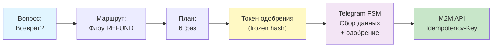
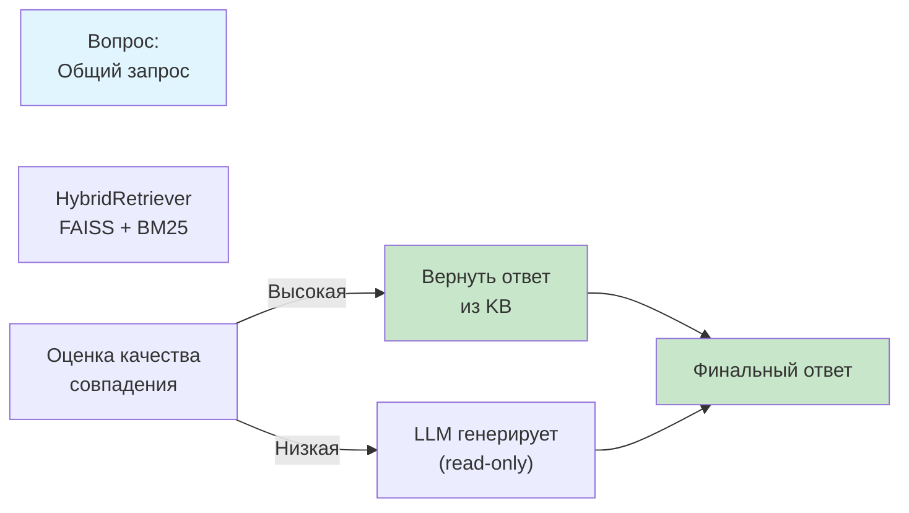
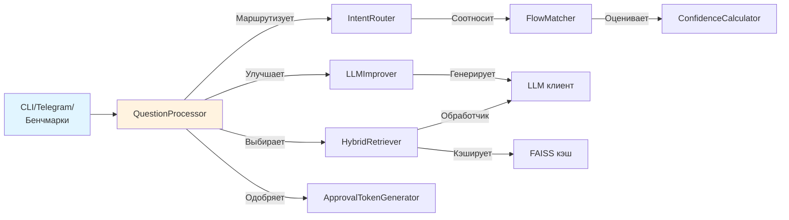

# QuickOffer Support Bot

Ядро обработки запросов поддержки: его можно запустить локально сейчас и подключить к Telegram позже. Построено на Python 3.12, FastAPI и aiogram v3.

- **Режим A** строит план одного из шести детерминированных сценариев. Изменяющие операции не доступны LLM и проходят через существующие approval/FSM.
- **Режим B** ищет ответ в базе знаний и при необходимости улучшает только read-only ответ с помощью LLM.
- Один `QuestionProcessor` используют локальная CLI, бенчмарки и будущие Telegram-обработчики.

## Содержание

1. [Быстрый старт](#быстрый-старт)
2. [Обзор архитектуры](#обзор-архитектуры)
3. [Структура проекта](#структура-проекта)
4. [Шесть флоу поддержки](#шесть-флоу-поддержки)
5. [Тестирование &amp; Бенчмарки](#тестирование--бенчмарки)

---

## Быстрый старт

### Требования

- Python 3.12+
- pip или poetry

### Локальная разработка (без учётных данных)

```bash
git clone <repository-url>
cd quickoffer-support-bot
pip install -e '.[dev,benchmarking]'
python -m src.benchmarking.interactive_demo
```

Демо работает полностью оффлайн. Запуск unit-тестов:

```bash
cp .env.example .env
pytest -v
```

### Mock режим (без внешних API)

```bash
# .env
USE_MOCKS=true
python run_bot.py
```

### С LLM провайдером

Для локального прокси LiteLLM:

```bash
# .env
LLM_PROVIDER=local
LLM_BASE_URL=http://localhost:4000/v1
LLM_PROVIDER_KEY=  # Может быть пусто
```

---

## Обзор архитектуры

### Конвейер обработки



### Режим A: Детерминированная машина состояний

Бот **никогда не выполняет инструменты** в Режиме A. Он создаёт безопасный план и токен одобрения. Telegram FSM выполняет после одобрения сотрудником.



### Режим B: Read-Only исследование



### Ключевые компоненты

| Компонент               | Расположение       | Назначение                                                                                     |
| -------------------------------- | ------------------------------ | -------------------------------------------------------------------------------------------------------- |
| **QuestionProcessor**      | `src/services/processing/`   | Главная граница приложения; маршрутизация и оркестровка |
| **IntentRouter**           | `src/services/processing/`   | Классификатор на Режим A или B                                                    |
| **HybridRetriever**        | `src/services/processing/`   | FAISS + BM25 + переранжирование                                                          |
| **ApprovalTokenGenerator** | `src/services/processing/`   | Замороженные токены одобрения                                                 |
| **LLMImprover**            | `src/services/processing/`   | Улучшение ответа (read-only)                                                              |
| **Telegram Router**        | `src/presentation/telegram/` | aiogram FSM-обработчики                                                                       |
| **M2M Clients**            | `src/infrastructure/m2m/`    | Клиенты fuckhr-api, jobs-api (Idempotency-Key)                                                    |
| **Database Models**        | `src/infrastructure/db/`     | SQLAlchemy async ORM                                                                                     |

---

## Структура проекта

```
quickoffer-support-bot/
├── src/
│   ├── benchmarking/              # Оффлайн тестирование производительности
│   │   ├── interactive_demo.py    # CLI-процессор
│   │   ├── benchmark.py           # Пропускная способность & затем
│   │   └── rag_retriever.py       # Производительность выборки
│   ├── core/
│   │   └── config.py              # Pydantic settings (.env)
│   ├── domain/
│   │   ├── entities.py            # Объекты домена (Conversation, Ticket и о.)
│   │   └── interfaces.py          # Онты репозиториев
│   ├── infrastructure/
│   │   ├── db/
│   │   │   ├── models.py          # SQLAlchemy async ORM
│   │   │   └── session.py         # Фабрика сессий базы данных
│   │   └── m2m/
│   │       ├── clients.py         # Базовый HTTP-клиент
│   │       ├── fuckhr_client.py   # FuckHR API (платежи, возвраты, карьера)
│   │       ├── jobs_client.py     # Jobs API (архивация, суппрессия)
│   │       ├── mock_clients.py    # Mock для локальной разработки
│   │       └── factory.py         # Фабрика клиентов (USE_MOCKS toggle)
│   ├── presentation/
│   │   ├── api/
│   │   │   └── routes.py          # FastAPI вебхуки & проверки здоровья
│   │   └── telegram/
│   │       ├── handlers.py        # Основные обработчики
│   │       ├── refund_handlers.py         # Флоу 1: Refund FSM
│   │       ├── jobs_handlers.py           # Флоу 3: Job Archival FSM
│   │       ├── approval_handlers.py       # Клавиатуры одобрения
│   │       ├── mode_b_handlers.py         # Обработчики режима B
│   │       ├── referral_flow.py           # Флоу 4: Referral промо
│   │       └── review_flow.py             # Флоу 5: Review промо
│   └── services/
│       ├── processing/
│       │   ├── question_processor.py      # Оркестратор
│       │   ├── intent_router.py           # Классификатор 6 флоу
│       │   ├── flow_matcher.py            # Ключевые слова & шаблоны
│       │   ├── hybrid_retriever.py        # FAISS + переранжирование
│       │   ├── confidence_calculator.py   # Оценка качества ответа
│       │   ├── approval_generator.py      # Генерация токенов
│       │   ├── llm_improver.py            # Оулчшение LLM
│       │   ├── processing_phases.py       # Enums & логирование
│       │   └── faiss_cache.py             # Кэширование индекса
│       ├── flows/
│       │   ├── refund_flow.py             # Refund FSM состояния
│       │   └── jobs_archival_flow.py      # Job archival FSM
│       ├── fsm.py                         # Определения состояния FSM
│       ├── handoff_engine.py              # Экскалация & таймауты
│       ├── llm.py                         # OpenAI-совместимый клиент LLM
│       ├── llm_investigation.py           # LLM-онли-исследование
│       ├── llm_tools.py                   # Определения инструментов
│       ├── approval_service.py            # Проверка токена
│       ├── staff_approval.py              # Обычный рабочий поток одобрения
│       └── identity.py                    # Проверка Telegram ID
├── docs/
│   ├── instruction.md                    # Операционная политика (6 флоу)
│   ├── rag_dataset_train.jsonl           # Тренировочные данные
│   ├── rag_dataset_test.jsonl            # Набор тестирования
│   ├── classified_dialogs.jsonl          # Примеры классификации намерения
│   └── faiss_indexes/                    # Индексы FAISS (генерируются)
├── migrations/                            # Alembic миграции базы данных
├── tests/
│   ├── conftest.py                       # pytest конфиг & fixtures
│   ├── test_question_processor.py        # Тесты корневого процессора
│   ├── test_config_and_llm.py            # Тесты конфигурации & LLM
│   └── test_handoff_triggers.py          # Тесты handoff & экскалации
├── .env.example                           # Шаблон окружения
├── .clinerules                            # Правила проекта
├── pyproject.toml                         # Настройки зависимостей
├── ARCHITECTURE.md                        # Подробная архитектура
├── Dockerfile                             # Определение расслыдки
├── docker-compose.yml                     # Локальные сервисы
├── alembic.ini                            # Конфигурация миграции
└── run_bot.py                             # Точка входа
```

### Зависимости модулей



---

## Шесть флоу поддержки

Все флоу являются **детерминированными** (Режим A). Процессор создаёт план; Telegram FSM выполняет после одобрения сотрудником.

| №          | Флоу                                  | Тип                 | Триггеры                   | Одобрение? |
| ----------- | ----------------------------------------- | ---------------------- | ---------------------------------- | ------------------- |
| **1** | **Возврат**                  | `REFUND`             | "возврат", "вернуть" | ✅ Да             |
| **2** | **Карьерная помощь** | `CAREER_HELP`        | "career", "резюме"           | ❌ Нет           |
| **3** | **Архивация**              | `JOB_ARCHIVAL`       | "archive", "архивиров"    | ✅ Да             |
| **4** | **Рефкод По**               | `REFERRAL_PROMO`     | "реферальный", По     | ❌ Нет           |
| **5** | **Код отзыва**             | `REVIEW_PROMO`       | "review", "отзыв"             | ❌ Нет           |
| **6** | **Крипто-оплата**       | `CRYPTO_ALT_PAYMENT` | "crypto", "крипто"           | ✅ Да             |

### Флоу 1: Возврат & Удаление подписки

**Триггер:** "возврат", "вернуть", "деньги"

**Требования:**

- Остидентифицируются по Telegram ID
- Основа возврата: услуга не началась, двойное списание или ошибка QuickOffer
- Частичный возврат (50%) если подписка была открыта

**Процесс:**

1. Остидентифицировать по Telegram ID
2. Получить последние платежи из fuckhr-api
3. Проверить основание возврата
4. Предложить заморожить подписку (расширение на 2 дня)
5. Если не подмненено, собрать ID аккаунта и чек
6. **Потребовать одобрение сотрудника**
7. Выполнить возврат + открытие подписки

### Флоу 2: Карьерная помощь

**Триггер:** "career", "резюме", "помощь"

**Требования:**

- Premium ≥14 дней
- Скидка ≤16%
- 1 кейс: 1 поцесс + 1 резюме
- SLA: 48 часов

**Процесс:**

1. Проверить права доступа (Premium + скидка)
2. Собрать: специальность, резюме, география, ЗП, опыт
3. Показать сэммари и попросить подтверждение
4. Перенаправить в экспертный чат с протрацированным SLA
5. Не нужно одобрение

### Флоу 3: Архивация вакансий

**Триггер:** "archive", "архивиров", "suppress"

**Требования:**

- Одобрение сотрудником обязательно
- Перманентная суппрессия (без переимпорта)

**Процесс:**

1. Собрать: URL/slug, причина, статус, доказательства
2. Получить карточку вакансии из jobs-api
3. **Потребовать одобрение**
4. Применить `SET_PERSISTENT_SUPPRESSION` флаг
5. Подтвердить пользователю

### Флоу 4: Промокод реферальный

**Триггер:** "реферальный", "По", "promo"

**Требования:**

- 1 код на аккаунт
- 15% скидка для друга
- Перманентно (без истечения)
- Повторное использование, если есть

**Процесс:**

1. Проверить связь Telegram ID
2. Получить ости или генерировать новый уникальный код
3. Вернуть код пользователю (одобрение не нужно)

### Флоу 5: Код отзыва

**Триггер:** "review", "отзыв", "feedback"

**Требования:**

- 15% скидка, перманентно, однократно
- Валидный отзыв только (text > 30 симв.)
- 1 код на аккаунт

**Процесс:**

1. Посмотреть статус отзыва
2. Если нет → отправить форму отзыва
3. Если валидный → генерировать/получить код
4. Вернуть код пользователю

### Флоу 6: Крипто / Иностранная оплата

**Триггер:** "crypto", "криптовалюта", "foreign card"

**Требования:**

- Реквизиты из безопасного конфига (LLM никогда не видит)
- Одобрение активации
- Нет авто-воссохранения для прямых писанией
- Нет выпуска если есть активная подписка

**Процесс:**

1. Собрать: тариф, период, метод
2. Получить расчёт + реквизиты
3. Отправить реквизиты + предупреждение о мошенничестве
4. Собрать чек / TX hash
5. **Потребовать одобрение**
6. Проверить + активировать

---

## Тестирование & Бенчмарки

### Unit-тесты

Тесты используют `pytest` с обыкновенным асинк-раннер:

```bash
# Запустить все тесты
pytest

# По многим + вывод
 pytest -v -s

# Отдельный тест
pytest tests/test_question_processor.py -v

# С отчёт покрытия
pytest --cov=src --cov-report=html
```

**Пример теста:**

```python
@pytest.mark.asyncio
async def test_deterministic_request_creates_safe_plan():
    processor = QuestionProcessor()
    result = await processor.process("Запрос на возврат")
  
    assert result.context.processing_mode is ProcessingMode.MODE_A_DETERMINISTIC
    assert result.context.executed_tools == []
    assert result.context.requires_staff_approval is True
    assert result.context.approval_token is not None
```

### Интерактивное демо

Локальная CLI без Telegram:

```bash
python -m src.benchmarking.interactive_demo
```

**Попытка:**

```
QuickOffer Support Bot — локальное демо. Наберите 'exit' в выхода до.

Вопрос: Хотел вернуть деньги
Режим: mode_a_deterministic
Флоу: REFUND
Нужно одобрение: True

Вопрос: Как настроить поиск?
Режим: mode_b_investigation
Ответ: Откройте Настройки → Поиск → персонализация фильтров.
Уверенность: high

exit
```

### Набор бенчмарков

Для оценки производительности:

```bash
# Пропускная способность
python -m src.benchmarking.benchmark --mode throughput --iterations 100

# Операция (ждение)
python -m src.benchmarking.benchmark --mode latency --iterations 1000

# Производительность выборки
python -m src.benchmarking.rag_retriever --dataset docs/rag_dataset_test.jsonl --top-k 5
```

Открытые файлы:

- `benchmark.log` — раотвороя времена
- `benchmark_results.json` — агрегируютые статистики

---

## Контрибюция & Нормы кода

### Форматирование кода

```bash
# Форматир (Ключи чёрные: 88 чарс, double quotes)
black src/ tests/

# Сортировка импортов (isort витоме чёрных)
isort src/ tests/

# Поверка типа (mypy в строгом режиме)
mypy src/
```

**Конвенции:**

- **Длина строки:** 88 символов (Black стандарт)
- **Скаши:** двойные кавычки (`"text"`)
- **Примечания типа:** Обязательны (mypy strict)
- **Импорты:** Отортируются via isort
- **Речвопысание:** NumPy стиль для многстков

### Основные принципы

Из `.clinerules`:

1. **Нист LLM-изоляция:** Никогда не разрешай те мутации LLM агентом
2. **Детерминированные токи:** Машины состояния с Pydantic валидацией
3. **M2M с одобрением:** Все мутации требуют токены одобрения + Idempotency-Key
4. **Фрозен псндснапснот:** Токены хешят параметры; любое отбор нирвует эта фб
5. **Нет название:** Продукционно-всѐ код усю эта не така `# TODO`

---

## Решение проблем

**"Нет такого модуля" ошибки:**

```bash
pip install -e '.[dev,benchmarking]'
```

**LLM ендпойнт недоступен:**
Обеспечить LiteLLM работаютэм:

```bash
litellm --model gpt-3.5-turbo --api_base http://localhost:4000
```

**Ошибки миграции базы данных:**

```bash
alembic upgrade head
```

---

## Лицензия

MIT

## Поддержка

- **Операционная политика:** См. `docs/instruction.md`
- **Примеры использования:** Найти в `tests/`
- **Глубокие детали:** Прочитать [ARCHITECTURE.md](ARCHITECTURE.md)
- **English версия:** Км. [README.md](README.md)
